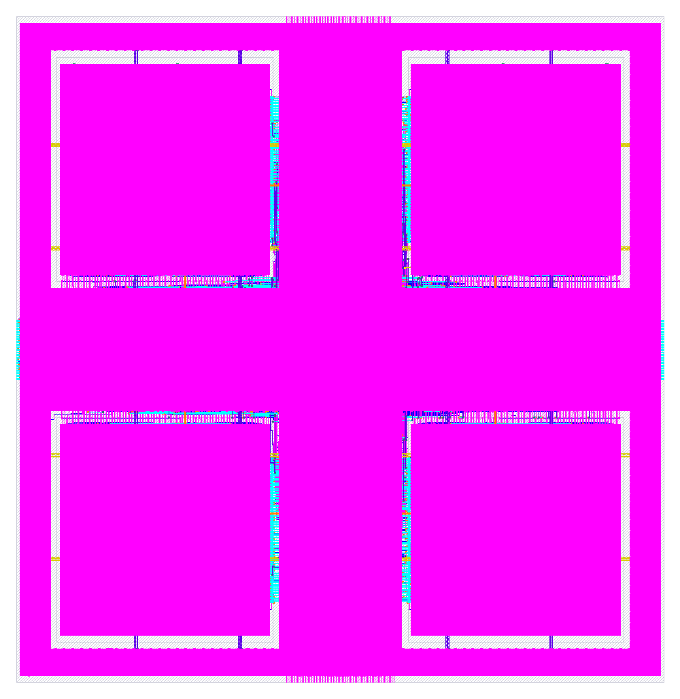

# jev_mesh_2x2

`jev_mesh_2x2` is a hardened hard macro for SkyWater SKY130 (`sky130_fd_sc_hd`). This package contains two views:

| File | What it is |
|---|---|
| `lef/jev_mesh_2x2.lef` | Abstract physical view (LEF 5.7) for place and route |
| `vh/jev_mesh_2x2.vh` | Verilog blackbox. Its signal ports match `rtl/jev_mesh_2x2.v` |
| `rtl/jev_mesh_2x2.v` | Hierarchical Verilog. Four `jev_dot_pipe` engines plus the routing around them |
| `rtl/jev_mesh_2x2.vhd` | Flat generated netlist of the same design |
| `rtl/jev_mesh_2x2.rom.txt` | Controller ROM tables for the route, the accept, the join, and the four engines |
| `rtl/jev_mesh_2x2_tb.v` / `rtl/jev_mesh_2x2_tb.vhd` | Self-checking testbenches (16 golden vectors) |
| `gds/jev_mesh_2x2.gds` | Hardened layout. The four engines are inside this die |
| `jev_mesh_2x2.png` | Picture of that layout |
| `metrics.json` | Signoff metrics for the hardening run |
| `lib/` | Nine liberty corners: min, nom, and max, each at ff −40 °C 1.95 V, ss 100 °C 1.60 V, and tt 25 °C 1.80 V |
| `librelane/config.json` | OpenLane config used for the run. Clock period 25 ns. Die area 0, 0, 959, 985 |
| `pins.cfg` | Pin order: north, south, west, east |

The `jev_dot_pipe` module source is the separate repository [jev-dot-pipe-sky130a](https://github.com/EncryptidSystems/jev-dot-pipe-sky130a). This repository instantiates that module. The pipe RTL stays in that repository.

## Macro summary

| Property | Value |
|---|---|
| Class | `BLOCK` |
| Size | 959.0 µm × 985.0 µm (origin 0, 0) |
| Signal pins | 270 (136 input bits, 134 output bits) |
| Power | `VPWR` and `VGND`, 15 vertical met4 segments and 7 horizontal met5 straps each. The horizontal straps run x = 5.52 to 953.12 µm. The longest vertical segments run y = 10.64 to 974.00 µm |
| Pin layers | met2 on the north (68) and south (70) edges, met3 on the east (66) and west (66) edges |
| Obstructions | nwell, li1, and met1 cover the core. met2 to met5 are partly blocked; see `OBS` in the LEF |
| Signoff | Corner `max_ss_100C_1v60`. Worst setup slack 2.774 ns. Worst hold slack 0.840 ns. Slew, capacitance, fanout, route DRC, Magic DRC, KLayout DRC, and LVS are 0 |

The four engines are placed by `librelane/config.json`:

| Instance | Location (µm) | Orientation |
|---|---|---|
| `e0_0` | 59.8, 592.96 | N |
| `e0_1` | 579.6, 592.96 | FN |
| `e1_0` | 59.8, 59.84 | FS |
| `e1_1` | 579.6, 59.84 | S |

## Ports

One beat is one clock on the north pins. Lane 0 is the column 0 word. Lane 1 is the column 1 word.

| Port | Dir | Width | Notes |
|---|---|---|---|
| `clk` | in | 1 | Clock |
| `rst` | in | 1 | Synchronous reset, active high |
| `n_valid` | in | 1 | A north beat is offered |
| `n_kind` | in | 2 | What the beat is. 0 activation, 1 weight, 2 reload, 3 fence |
| `n_d0` | in | 32 | Lane 0, column 0 |
| `n_d1` | in | 32 | Lane 1, column 1 |
| `s_ready` | in | 1 | The south neighbor can take a beat |
| `w_valid` | in | 1 | West partial sums are offered |
| `w_p0` | in | 32 | West partial for row 0 |
| `w_p1` | in | 32 | West partial for row 1 |
| `e_ready` | in | 1 | The east neighbor can take the scores |
| `n_ready` | out | 1 | This die took the north beat |
| `s_valid` | out | 1 | A south beat is waiting |
| `s_kind` | out | 2 | Kind of the south beat |
| `s_d0`, `s_d1` | out | 32 each | The two lanes of the south beat |
| `w_ready` | out | 1 | The west partials were taken, on the clock the scores are emitted |
| `e_valid` | out | 1 | Scores are waiting on the east side |
| `e_p0` | out | 32 | Row 0 score |
| `e_p1` | out | 32 | Row 1 score |
| `VPWR`, `VGND` | inout | 1 | Only when `USE_POWER_PINS` is defined |



## How it works

This section was traced from `rtl/jev_mesh_2x2.v`. Sums are 32-bit, so they wrap at 2^32.

**Four engines on one die.** The engines are `e0_0`, `e0_1`, `e1_0`, and `e1_1`. Each one is a `jev_dot_pipe`: four multiply-adds, one product per clock, 32-bit sum. Row 0 column 0 is `e0_0`. Row 0 column 1 is `e0_1`. Row 1 column 0 is `e1_0`. Row 1 column 1 is `e1_1`. Both engines in a row see the same activation words. Each engine has its own four weights.

**What a north beat does.** `n_kind` and a fill count pick the action. The fill count `wcnt` reaches 8 when all 16 weights are stored (2 rows × 2 columns × 4 weights). The choice is the table in the Verilog:

| Fill | `n_kind` | Action |
|---|---|---|
| under 8 | 0 activation | Stage the words, and send the beat south |
| under 8 | 1 weight | Store the words here |
| under 8 | 2 reload | Clear the fill count, and send the beat south. Stored weights stay until a later weight beat overwrites them |
| under 8 | 3 fence | Send the beat south |
| full | 0 activation | Stage the words, and send the beat south |
| full | 1 weight | Send the beat south. This die is already full |
| full | 2 reload | Clear the fill count, and send the beat south |
| full | 3 fence | Send the beat south |

**Weights.** Beat number `b` of a fill writes weight `(row = b / 4, k = b mod 4)` from each lane into that column. Lane 0 writes column 0. Lane 1 writes column 1. The register for engine `(row, column)` weight `k` is index `(row * 2 + column) * 4 + k`. Eight beats fill the die.

**Activations.** Four beats stage a set. Beat `k` writes `n_d0` into column 0 slot `k` and `n_d1` into column 1 slot `k`. On the fourth beat, if the engines can take a set, those staged words become the words the engines multiply. The same column words go to both rows.

**When a beat is taken.** `n_ready` is the accept.

- A weight beat is taken on the clock it is offered.
- An activation beat is taken when the south buffer has room and the engines can accept the set. The fourth beat is the one that starts the engines.
- A reload or a fence is taken when the south buffer has room.

Otherwise the beat waits.

**South.** Activations, weights that are passing through, reloads, and fences go out the south pins. The south buffer is two beats deep, so one clock of back-pressure from `s_ready` fits in the buffer. `s_valid`, `s_kind`, `s_d0`, and `s_d1` are the beat at the head.

**East.** The scores leave when three things are true on the same clock: engine `e0_0` has a finished sum, `w_valid` is high, and the east buffer has room. The row sums are

```
e_p0 = (w_p0 + e0_0) + e0_1
e_p1 = (w_p1 + e1_0) + e1_1
```

`w_ready` is high on that same clock, which takes the west partials. The east buffer is two scores deep.

## RTL

The VHDL is the flat netlist from the WASMApollo EDA (heapvm vgpu apollo), generated from the typed fabric `jev_mesh_2x2`. The Verilog is the same ports and the same clocking, written as four `jev_dot_pipe` instances plus the router, the weight registers, the activation staging, the south and east buffers, and the row adders.

| Property | Value |
|---|---|
| LUT4 cells | 297, in the flat VHDL netlist |
| Word PEs | 132 |
| Registers | 133 |
| Combinational depth | 11 levels |
| Clocking | Single `clk`. Every register latches on the rising edge from the settled levels |
| Reset | `rst` is synchronous, active high, and loads the fabric's initial state |

### Microcode ROMs

The tables are in `rtl/jev_mesh_2x2.rom.txt` and in the header of `rtl/jev_mesh_2x2.vhd`. Codes are LSB first.

`jev_route` maps `{full, n_kind}` to the action. States 0 to 7:

| State | Answer | Code |
|---|---|---|
| 0 | stage | `00` |
| 1 | load | `01` |
| 2 | reset | `11` |
| 3 | pass | `10` |
| 4 | stage | `00` |
| 5 | pass | `10` |
| 6 | reset | `11` |
| 7 | pass | `10` |

`jev_accept` is take or stall. The Verilog case is the rule above: a weight is taken, an activation is taken when the south buffer and the engines have room, and a pass or a reload is taken when the south buffer has room.

`jev_join` is hold or emit. Emit is the clock where the engine result, the west partials, and east room are all present. In the ROM, states 0 to 6 are hold and state 7 is emit.

Each engine has `route_x`, `route_w`, and `mac_op`, the same three ROMs as `jev_dot_pipe`. States 0 to 3 select `x0`/`w0` through `x3`/`w3`, and every state selects `mac`.

## Simulation

Both testbenches are self-checking. Each vector holds `rst` for one cycle, runs 24 cycles, and then compares every output against the fabric's golden model (RefSim).

The Verilog testbench instantiates `jev_mesh_2x2`, and that module instantiates `jev_dot_pipe`. Compile the pipe RTL from [jev-dot-pipe-sky130a](https://github.com/EncryptidSystems/jev-dot-pipe-sky130a) on the same command line. The VHDL netlist is flat, so its command is self-contained.

```sh
# Verilog (Icarus). Path to the pipe RTL as checked out beside this repo.
iverilog -o tb ../jev-dot-pipe-sky130a/rtl/jev_dot_pipe.v jev_mesh_2x2.v jev_mesh_2x2_tb.v && vvp tb
# expected: PASS jev_mesh_2x2: 16 vectors

# VHDL (GHDL), from rtl/
ghdl -a jev_mesh_2x2.vhd jev_mesh_2x2_tb.vhd && ghdl -e jev_mesh_2x2_tb && ghdl -r jev_mesh_2x2_tb
```

The VHDL testbench was run with GHDL and passes all 16 vectors. The Icarus command above is the Verilog run.

## Using the macro

### In RTL

```verilog
`include "jev_mesh_2x2.vh"

jev_mesh_2x2 u_mesh (
`ifdef USE_POWER_PINS
  .VPWR(vccd1),
  .VGND(vssd1),
`endif
  .clk(clk), .rst(rst),
  .n_valid(n_valid), .n_kind(n_kind), .n_d0(n_d0), .n_d1(n_d1),
  .s_ready(s_ready),
  .w_valid(w_valid), .w_p0(w_p0), .w_p1(w_p1),
  .e_ready(e_ready),
  .n_ready(n_ready),
  .s_valid(s_valid), .s_kind(s_kind), .s_d0(s_d0), .s_d1(s_d1),
  .w_ready(w_ready),
  .e_valid(e_valid), .e_p0(e_p0), .e_p1(e_p1)
);
```

The blackbox file in this package is `vh/jev_mesh_2x2.vh`. Define `USE_POWER_PINS` for power-aware simulation and LVS. Leave it undefined for plain RTL simulation.

### In OpenLane / OpenROAD

The finished die is one hard macro. Add its LEF, its GDS, and its blackbox:

```json
"EXTRA_LEFS": ["dir::lef/jev_mesh_2x2.lef"],
"EXTRA_GDS_FILES": ["dir::gds/jev_mesh_2x2.gds"],
"VERILOG_FILES_BLACKBOX": ["dir::vh/jev_mesh_2x2.vh"]
```

Then connect `VPWR` and `VGND` to the power grid through the met4 and met5 straps. The GDS in this package is `gds/jev_mesh_2x2.gds`.

Re-running place and route on `rtl/jev_mesh_2x2.v` also needs the `jev_dot_pipe` LEF, GDS, and liberty views, because the Verilog instantiates that module four times. `librelane/config.json` records those views under `MACROS.jev_dot_pipe` and records the four placements in the table above. Those `dir::macro/` paths are the pipe views from jev-dot-pipe-sky130a, copied into the hardening workspace that produced this GDS.

## Other PDKs

The `VPWR`/`VGND` names belong to the hardened SKY130 view. To target another public PDK, synthesize `rtl/jev_mesh_2x2.v` there, with `jev_dot_pipe` either inlined or supplied as that PDK's hard macro, and use that PDK's supply names. The LEF only applies to SKY130.
